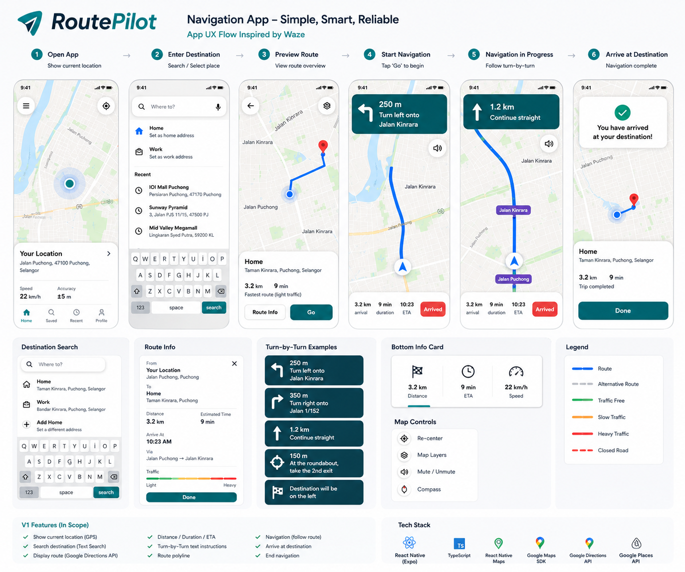
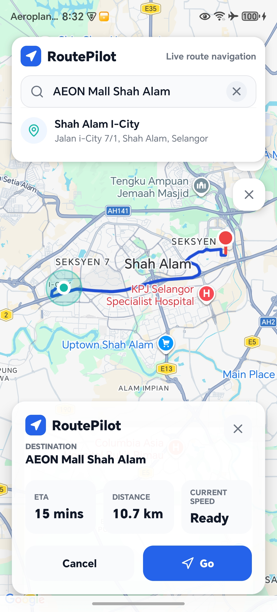
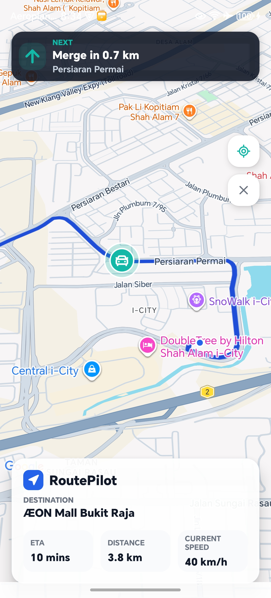
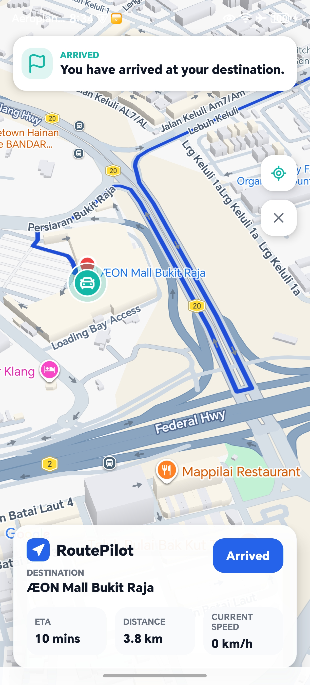

# RoutePilot

RoutePilot is a lightweight navigation prototype built with React Native, Expo, and Google Maps Platform.

It demonstrates real-time location tracking, destination search, route preview, ETA calculation, expandable route steps, and a modern mobile navigation experience.


## Prototype Preview

Built for Android using Expo Development Build.



## Project Purpose

RoutePilot was created to explore modern mobile navigation workflows and user experience using React Native, Expo, and Google Maps Platform.

RoutePilot V1 is a focused prototype, not a full Google Maps or Waze clone.

## Why RoutePilot

Most portfolio projects focus on generic CRUD applications.

RoutePilot focuses on a real-world mobile navigation workflow and demonstrates product thinking, UX flow, Google Maps integration, and mobile application architecture.

The goal is not to replace Google Maps or Waze, but to demonstrate engineering capability through a focused navigation experience.

## Tech Stack

### Mobile

- React Native
- Expo
- TypeScript

### Maps & Location

- React Native Maps
- Google Maps SDK
- Google Places API
- Google Directions API
- Device GPS / location services

### Development

- Expo
- Android Development Build

### Backend

Not required for V1.

### Database

Not required for V1.

## Architecture Overview

```text
React Native Mobile App
        |
        v
Expo Development Build
        |
        v
Google Maps Platform
        |
        |-- Maps SDK
        |-- Places API
        |-- Directions API
        `-- Device GPS / Location Services
        |
        v
Route Preview + Navigation UI
```

RoutePilot V1 is frontend-only. It does not require a backend or database because route search, route preview, and navigation UI are handled directly in the mobile app using Google Maps Platform APIs.

## Features

- Current location detection
- Destination search / selection
- Route preview
- ETA and distance display
- Lightweight navigation instruction card
- Expandable route step panel
- Arrival state
- RoutePilot custom UI theme
- Configurable demo destination for navigation showcase

Speed is based on device GPS updates and may vary in emulator/demo mode.

## Screenshots

### Route Preview



### Navigation Mode



### Arrival State



## Demo

Demo video files:

```text
docs/routepilot-v1-demo-video/routepilot-v1-demo-video-take-01.mp4
docs/routepilot-v1-demo-video/routepilot-v1-demo-video-take-02.mp4
```

A short demo video should show:

1. Open RoutePilot
2. Show current location
3. Search / select destination
4. Preview route
5. Start navigation
6. View ETA / distance / speed
7. Expand and collapse route steps
8. Arrive at destination

## Design Philosophy

RoutePilot intentionally focuses on a clean navigation experience instead of feature completeness.

The goal of V1 is to demonstrate product thinking, mobile UX, Google Maps integration, route preview, and lightweight navigation flow without trying to clone Google Maps or Waze.

Features such as backend storage, trip history, voice navigation, real-time traffic prediction, and auto rerouting are intentionally excluded from V1 to keep the prototype focused and maintainable.

## Setup

Clone the repository and install dependencies:

```powershell
git clone <your-repository-url>
cd RoutePilot
npm install
```

Create a `.env` file from `.env.example`:

```bash
cp .env.example .env
```

On Windows PowerShell, you may also use:

```powershell
Copy-Item .env.example .env
```

Add your Google Maps API key:

```text
GOOGLE_MAPS_API_KEY=your_google_maps_api_key_here
```

Do not commit real API keys. Local `.env` files are ignored by git.

Enable these Google APIs for the key:

- Maps SDK for Android
- Places API
- Directions API

## Run Android

Check connected emulator or physical Android device:

```powershell
npm run android:devices
```

Start Expo Metro:

```powershell
npm start
```

Install or rebuild the Android development build:

```powershell
npm run android:rebuild
```

If your terminal points to an incompatible Java version, use the local JDK 17 helper:

```powershell
npm run android:rebuild:jdk17
```

Direct Expo command:

```powershell
npx expo run:android --port 8322
```

Android package name:

```text
com.routepilot.mobile
```

For emulator GPS, enable Location in Android Emulator settings. For a physical Android device, enable USB debugging.

## Environment Variables

The Google API key is required for Maps, Places, and Directions services. Do not commit real API keys to the repository.

```text
GOOGLE_MAPS_API_KEY=your_google_maps_api_key_here
```

If the key is missing or a Google API call fails, RoutePilot shows a warning and falls back to a simulated demo route.

## V1 Scope and Limitations

RoutePilot V1 intentionally focuses on the core navigation experience.

The focus of V1 is to demonstrate navigation workflow rather than navigation intelligence.

Included in V1:

- Mobile navigation prototype
- Current location
- Destination search
- Route preview
- ETA / distance display
- Lightweight navigation instruction
- Expandable route steps
- Arrival state

Not included in V1:

- Backend
- Database
- Login / user account
- Voice navigation
- Real-time traffic prediction
- Auto rerouting
- Offline map
- Payment
- Push notifications
- Trip history
- Fleet dashboard
- Driver / passenger workflow
- AI features

## Future Improvements

- Route history
- Saved places
- Real-time location sharing
- Route replay

## License

This project is intended for educational and portfolio purposes only.
